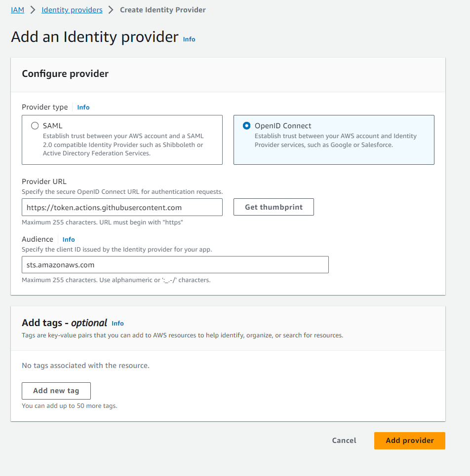
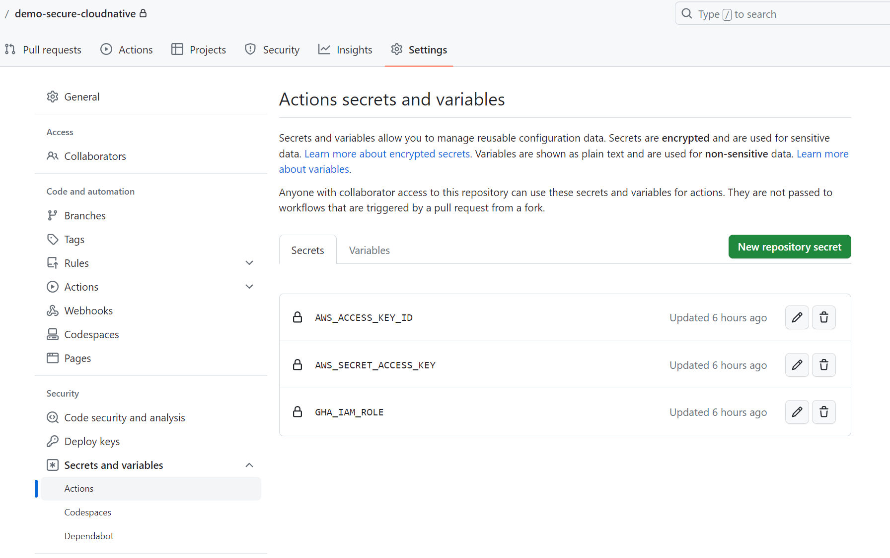
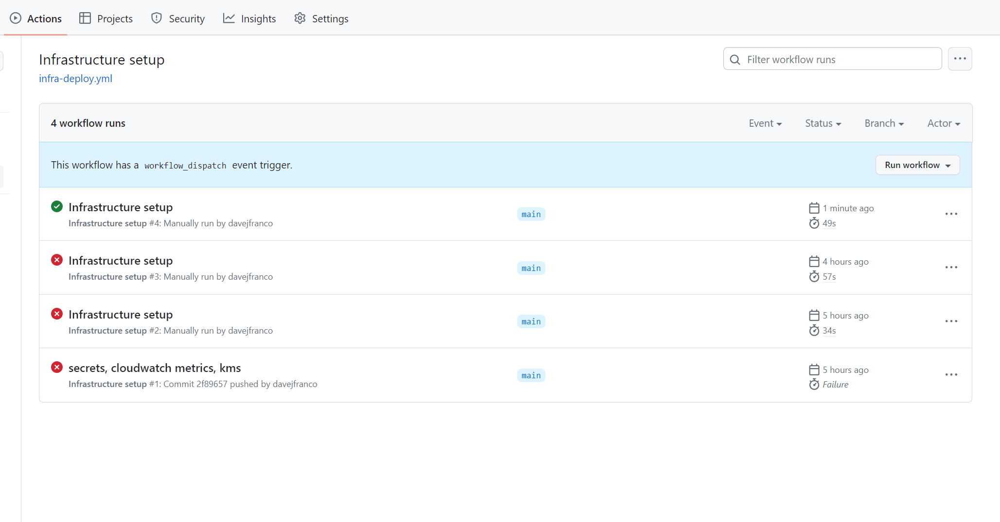
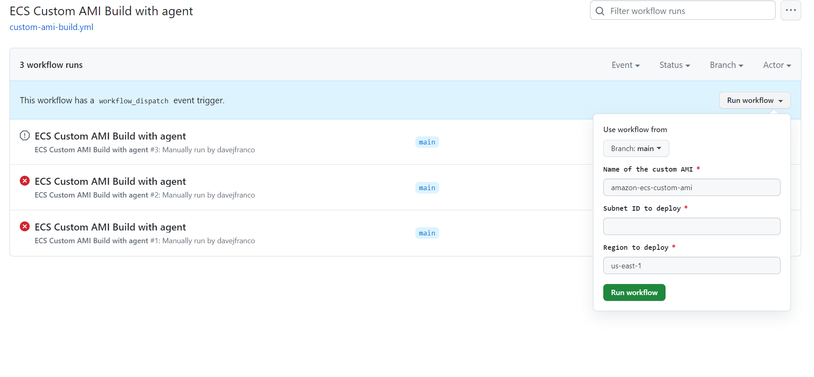
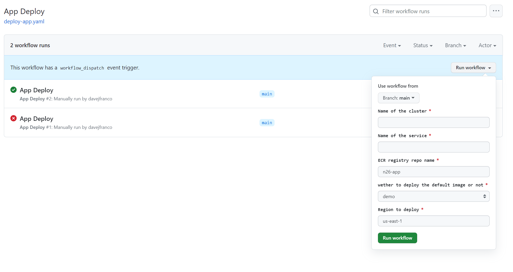

## How to run the project

### Prerequisites
- Terraform >= 1.5.0
- AWS CLI installed and configured
- AWS account with permissions to create the infrastructure
- Github
- Docker
- Packer

### Steps
1. Clone this repository

2. Create user with admin credentials to deploy the infrastructure. 

3. Create a OIDC provider in AWS IAM for github actions. 

4. Go to the github repo to create the secrets needed to deploy the infrastructure.

We will only create the AWS credentials, the `GHA_IAM_ROLE`we will create it later.

5. Deploy the infrastructure using Github Actions.

Move to the `Actions` tab and select the `Infrastructure setup` workflow. Click on `Run workflow` and wait for the infrastructure to be deployed.

6. Once the infrastructure is deployed, we can go to IAM and look for the github action iam role arn. The name of the role is `gh-manager` we can now create the secret in `GHA_IAM_ROLE` with the value of the arn.

7. Create customAMI (optional)

If you want to test baking a new AMI with the agent installed run the workflow `ECS Custom AMI` and wait for the AMI to be created. You will have to provide a public subnet id for Packer to work.

8. Deploy app

Once the infrastructure is deployed we can deploy the app. 

This workflow will build a sample app docker image, push it to ECR and deploy it in the ECS cluster. if the variable `deploy` is set to `demo` the ecs service will get updated with a `nginx:alpine-slim` image. If the variable `deploy` is set to `apo` the ecs service will get updated with the image built in the workflow (This is because I didn't have time to finish the app). You will also need to provide the cluster name and the service name.

