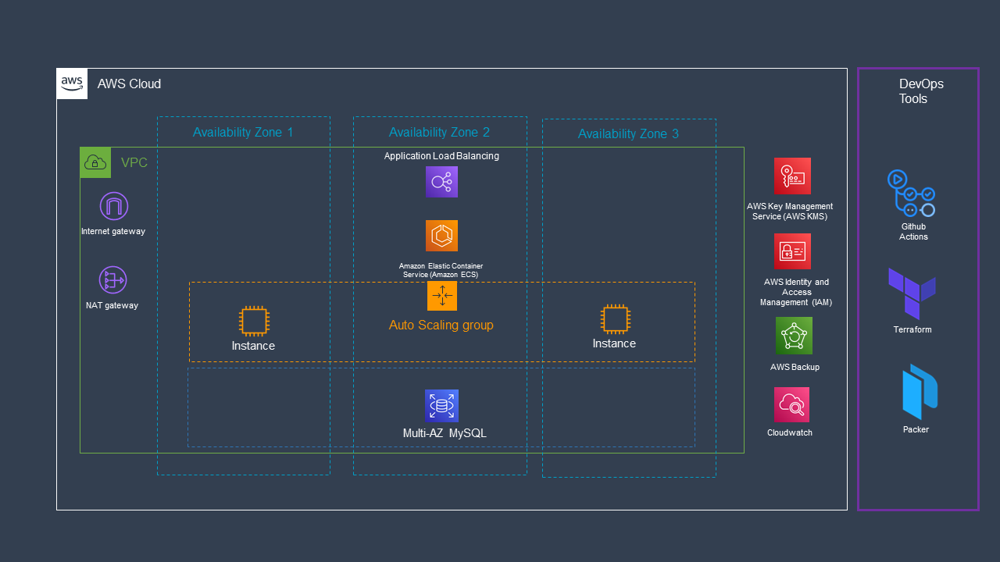

# Secure Demo APP

This is a demo infrastructure to showcase a highly available and secure application running on AWS.

## Infrastructure diagram



This infrastructure is composed of the following components:

- AWS ECS cluster running in three availability zones using autoscaling as capacity provider. This will provide HA and scalability to the application. The servers are running in private subnets and the only way to access them is through the ALB. 

  The cluster creation can be found in the [ECS module](./infrastructure/modules/stack) 

    - [ECS](./infrastructure/modules/ecs)

- AWS RDS database running in multi-az mode, which will provide HA and scalability to the database. The database is running in private subnets and the only way to access it is through the ECS cluster. The database credentials are stored in AWS Secret Manager and are dynamically creating during the infrastructure creation. The database is encrypted with a customer managed key which is also replicated in another region in case of a disaster recovery scenario.

  Database section is also part of the stack module.

    - [RDS](./infrastructure/modules/stack/rds.tf)

- AWS Secret Manager to store the database credentials. The credentials are stored in a secret and the secret is encrypted using a KMS key.

  Secret manager section is also part of the stack module.

    - [Secret Manager](./infrastructure/modules/stack/secrets.tf)

- Cloudwatch along side RDS performance insights are in charge of monitoring the infrastructure and the application.

  Cloudwatch section is also part of the stack module.

    - [Cloudwatch](./infrastructure/modules/stack/cloudwatch.tf)
    - [RDS Performance Insights](./infrastructure/modules/stack/rds.tf)

- KMS is the service that allow us to encrypt and decrypt RDS storage, secrets. In this project we use customer managed key but also we can use the default key provided by AWS. 
  
    KMS section is also part of the stack module.
  
    - [KMS](./infrastructure/modules/stack/kms.tf)

- By Default all EBS created are encrypted using the default KMS key.

  EBS configuration can be found here

    - [EBS](./infrastructure/ebs.tf)

- The Backup system is using AWS Backup service which is the best approach to handle backups of RDS. This service is deployed by a module, The repo can be found here: [Backup module](https://github.com/davejfranco/terraform-aws-backup)

    - [Backup](./infrastructure/backup.tf)

- To deploy the infrastructure and test custom AMI we use Github Action because the proyect itself is hosted on Github and this makes GHA the easiest way. The code can be found here: [Github Action](./.github/workflows)


## Custom Agent for ECS

When it comes to install a security agent in a ECS cluster which is a dynamic environment, we have two options:

- Bake the agent in a new AMI and use it in the ECS cluster. This is the approach used in this demo. The code uses `Packer` to build a new AMI with the agent installed. The agent is a dummy script that can be run as a service with systemd. You can update the terraform code so that the ECS cluster updates the launch configuration to use the new AMI. The code of the agent can be found here: [Custom AMI](./customAMI)

Also in the `main.tf` file at the end you can use the custom AMI by changing the `ecs_ami_id` variable.

```bash	
  #main.tf file
  #ECS config
  ecs_ami_id = data.aws_ami.ecs_default.image_id #change this if you need a custom ami id
```

- And the second option is to deploy the agent as a container in the ECS task definition. There is a Dockerfile that can be used to build the image of the agent and then it can be deployed as a second container in the ECS task definition. The code can be found here: [Agent](./agent). Another way would be to use AWS SSM to install the agent in the ECS instances. 

The instruction to test this repo can be found [here](INSTRUCTIONS.md)